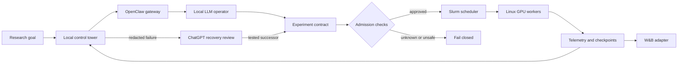

# 🌙 Agentic Research Supervisor 🌙

### Autonomous overnight ML experiments across Slurm GPU workers

[Overview](#-overview) • [Architecture](#-architecture) • [Target system](#-target-system) • [Workflow](#-overnight-workflow) • [Safety](#-core-guardrails) • [Roadmap](#-current-focus)

This repository includes just the skeleton of the prior work.

## 🔬 Overview

Agentic Research Supervisor is an early-stage control plane for long-running
machine learning experiments. It is designed to combine a bounded local
OpenClaw and local LLM interface, Slurm-managed Linux GPU workers,
ChatGPT-assisted recovery review, and W&B experiment telemetry.

Agents can plan, observe, and suggest recovery actions. Deterministic contracts
decide what may run. Slurm remains authoritative for GPU allocation and job
state.

Development is active across the control plane and integration boundaries.
This snapshot is documentation-only and includes no credentials, deployment
configuration, live fleet details, implementation source, or run results.

## 🏗️ Architecture



The agent layer uses narrow, typed actions. Raw shell, SSH, credentials,
filesystem access, arbitrary network access, and direct Slurm commands remain
outside that boundary.

## 📋 Target system

| Component | Target state | Direction |
| --- | --- | --- |
| Local control tower | ✅ Fully functioning | Unify contracts, evidence, and operator decisions |
| OpenClaw and local LLM | ✅ Fully functioning | Provide a bounded interface for experiment operations |
| Experiment contracts | ✅ Fully functioning | Capture source, parameters, limits, and resource needs |
| Slurm adapter | ✅ Fully functioning | Connect approved plans to scheduler-owned resources |
| W&B adapter | ✅ Fully functioning | Feed metrics and run metadata into supervision |
| ChatGPT recovery review | 🛠️ Implementing | Turn redacted failures into successor proposals |
| Overnight autonomy | 🛠️ Implementing | Add guarded supervision and bounded recovery |
| Morning reporting | 🛠️ Implementing | Summarize progress, evidence, failures, and next actions |

## 🔄 Overnight workflow

1. Define the research objective, source, entrypoint, parameters, limits,
   success criteria, and required resources.
2. Compile those inputs into an immutable experiment contract.
3. Discover available resources through a read-only fleet snapshot.
4. Admit one exact runtime and GPU shape, then request it through Slurm.
5. Reconcile job state, checkpoints, and W&B telemetry throughout the run.
6. Convert failures into redacted review cases and validate any repair as a new
   successor before resuming.
7. Produce a morning report that separates plans, tests, qualified runs, and
   admitted runs.

## 🛡️ Core guardrails

- **Fail closed** when requirements, identity, evidence, or telemetry is unclear.
- **Keep least authority** by exposing research actions rather than machine access.
- **Bind exact resources** without silently substituting GPUs, hosts, or runtimes.
- **Bound every campaign** by trial, time, queue, and recovery limits.
- **Repair through successors** rather than changing an active run in place.
- **Report evidence honestly** without presenting a plan or simulation as a live result.

See [the safety model](docs/safety-model.md) for the intended trust boundaries.

## 🗂️ Repository map

```text
.
├── control-plane/          # Supervisor and evidence boundary
├── contracts/              # Experiment contracts and schemas
├── integrations/
│   ├── openclaw/          # Local agent gateway
│   ├── chatgpt/           # Recovery review boundary
│   └── wandb/             # Experiment telemetry boundary
├── scheduler/slurm/        # Scheduler allocation interface
├── training-harness/       # Program-owned training boundary
├── examples/               # Non-executable examples
├── docs/                   # Architecture and safety notes
└── tests/                  # Planned contract and simulation checks
```

## 🧭 Current focus

- Versioned experiment, allocation, telemetry, checkpoint, repair, and report contracts
- Read-only Slurm inventory and deterministic admission planning
- Simulated campaign tests before any live scheduler connection
- Redaction checks for ChatGPT review cases and W&B metadata
- Safe stop, resume, checkpoint, stale-evidence, and failed-repair behavior
- Qualification of one exact end-to-end shape before unattended operation

## 📚 References

- [OpenClaw documentation](https://docs.openclaw.ai/)
- [Slurm Workload Manager documentation](https://slurm.schedmd.com/)
- [W&B Runs documentation](https://docs.wandb.ai/models/runs)
- [OpenAI model and agent guidance](https://developers.openai.com/api/docs/guides/latest-model)
- [MIT License reference at SPDX](https://spdx.org/licenses/MIT.html)

## 📄 License

Released under the [MIT License](LICENSE).

Third-party names are used for identification only. This independent project
is not affiliated with or endorsed by OpenClaw, SchedMD, OpenAI, or
Weights & Biases. See [NOTICE.md](NOTICE.md).
